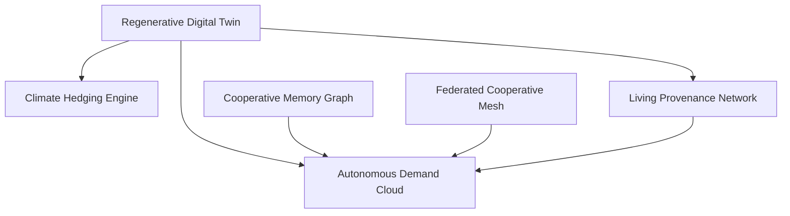

# MOONSHOT-ANALYSIS

## Executive summary

AgriRomagna is no longer just a polished farm-management demo. The repository already contains the raw ingredients of a **cooperative operating system**: event-driven signal fusion, lot-level traceability, insurance triggers, carbon accounting, federation models, knowledge graph primitives, JWT auth, and deep RBAC.

The moonshot opportunity is to stop adding isolated modules and instead turn the codebase into a set of **control planes** that orchestrate those modules into new market categories:

1. **Regenerative Digital Twin**
2. **Cooperative Memory Graph**
3. **Federated Cooperative Mesh**
4. **Climate Hedging Engine**
5. **Living Provenance Network**
6. **Autonomous Demand Cloud**

These six moonshots are now implemented in this branch as a portfolio control tower:

- `src/lib/moonshot-operating-system.ts`
- `src/app/api/moonshots/route.ts`
- `src/app/api/moonshots/[feature]/route.ts`
- `src/app/dashboard/moonshots/page.tsx`
- `tests/lib/moonshot-operating-system.test.ts`
- `src/app/dashboard/layout.tsx` (navigation entry)

---

## 1. Deep repository understanding

### 1.1 Architecture reality

**Framework and app structure**
- Next.js 16 App Router with route handlers under `src/app/api/*`.
- Shared dashboard shell and a very broad module surface under `src/app/dashboard/*`.
- Route-handlers follow the native `Request`/`Response` model; the Next 16 docs confirm dynamic route params are async and should be awaited in handler context. See `node_modules/next/dist/docs/01-app/01-getting-started/15-route-handlers.md` and `node_modules/next/dist/docs/01-app/03-api-reference/03-file-conventions/route.md`.

**Data architecture**
- Prisma schema with **36 models** in `prisma/schema.prisma`.
- Better-SQLite3 adapter and generated Prisma client in `src/generated/prisma/*`.
- Dual data strategy:
  - persisted query wrappers in `src/lib/data-layer.ts`
  - many feature modules still use `InMemoryStore` from `src/lib/db.ts`
- This makes the product fast to prototype, but creates a split-brain architecture: some surfaces behave like a SaaS backend, others like seeded scenario simulators.

**Operational substrate already present**
- JWT auth + refresh tokens + bcrypt in `src/lib/auth-service.ts`
- request gating in `src/middleware.ts`
- extensive RBAC in `src/lib/rbac-middleware.ts` with **7 roles** and a permission lattice including dashboard, marketplace, insurance, federation, analytics, compliance-chain, and knowledge-graph access
- telemetry collector in `src/lib/telemetry.ts`
- cross-module eventing in `src/lib/event-bus.ts`
- fused field-state engine in `src/lib/intelligence-fabric.ts`

**UI/product architecture pattern**
The dominant pattern is:

`lib/*-data.ts` → `app/api/*/route.ts` → `app/dashboard/*/page.tsx`

That pattern is consistent enough to support rapid moonshot layering without a core rewrite.

### 1.2 Latent capabilities already hiding in the repo

| Capability | Evidence in repo | Why it matters for moonshots |
|---|---|---|
| Cross-signal field fusion | `src/lib/intelligence-fabric.ts` | This is already the skeleton of a digital twin engine. |
| Cross-module orchestration | `src/lib/event-bus.ts` | Lets new features behave like control planes instead of static dashboards. |
| Cooperative federation | `src/lib/federation-data.ts` | Opens the door to multi-cooperative liquidity, shared supply, and network effects. |
| Machine-readable trust | `src/lib/traceability-data.ts`, `src/lib/compliance-chain-data.ts` | Trust can become a commercial premium surface, not only an audit artifact. |
| Climate-financial linkage | `src/lib/insurance-data.ts`, `src/lib/carbon-data.ts` | Repo can evolve from compliance software to resilience/hedging software. |
| Institutional memory | `src/lib/knowledge-graph-data.ts`, `src/lib/benchmarking-data.ts` | Cooperative know-how can become a retained data asset. |
| Natural-language agronomy | `src/lib/ai-advisor.ts` | Current rule engine is an obvious bridge to a future copilot layer. |

### 1.3 Constraints and structural risks

| Constraint | Impact |
|---|---|
| SQLite primary datasource | limits concurrency, write throughput, and long-horizon operational history |
| Many modules still use `InMemoryStore` | state loss on restart; weak fit for network-level features |
| Seed-heavy domain surfaces | rich demos, but external integrations are still thin |
| Middleware deprecation warning in build | Next.js warns that `middleware` should migrate to `proxy` eventually |
| Full-lint baseline is already red | existing `no-explicit-any` errors in legacy API routes; unrelated to this branch |

### 1.4 What the repository is *really* good at

AgriRomagna’s strongest strategic trait is not “farm dashboards.” It is **composability across regulated agricultural workflows**:

- agronomy
- compliance
- traceability
- insurance
- carbon
- governance
- federation
- commercial intelligence

Most farm SaaS products stop at field records or precision agriculture. This repo already spans **operations + trust + finance + network coordination**.

That is the substrate for a market-redefining product.

---

## 2. Market and competitive research

### 2.1 Structural market signals

1. **The European farm base is huge, fragmented, and still dominated by small holdings.** Eurostat reports **8.8 million agricultural holdings in the EU in 2023**, with Italy accounting for about **1.3 million** and roughly **62.8%** of EU farms under 5 hectares. That strongly favors software that can aggregate many smaller producers rather than only optimize mega-farms.  
   Source: https://ec.europa.eu/eurostat/statistics-explained/index.php?title=Farms_and_farmland_in_the_European_Union_-_statistics

2. **Climate volatility is now an economic operating constraint, not just an agronomic one.** The EEA’s 2026 briefing frames climate-resilient agriculture as an economic stabilization strategy and notes crop losses from extreme events running materially above trend expectations; drought, heavy rain, frost, and hail dominate agricultural loss patterns.  
   Source: https://www.eea.europa.eu/en/analysis/publications/building-climate-resilient-agriculture-in-europe-an-economic-perspective

3. **Italy’s cooperative base is a durable distribution advantage.** Euricse maintains a database covering over **80,000 Italian cooperatives**, reinforcing that cooperative-native infrastructure is not a niche edge-case but a massive institutional substrate.  
   Source: https://euricse.eu/en/projects/database-of-cooperatives-in-italy/

4. **Emilia-Romagna is structurally cooperative.** Regional cooperative reporting highlights Emilia-Romagna as one of Italy’s densest cooperative economies, with over **4,000 active cooperatives** and an outsized share of national cooperative turnover. Even though that statistic is broader than agriculture alone, it validates a cooperative-native go-to-market.  
   Source: https://www.legacoop.coop/rapporto-biennale-sullo-stato-della-cooperazione-2022-23-emilia-romagna-un-terzo-del-fatturato-nazionale-del-paese-proviene-dalla-regione/

5. **Machine-readable product transparency is becoming a first-class policy direction in Europe.** The European Commission’s Digital Product Passport work under the Ecodesign / sustainable products agenda normalizes the idea that product trust, provenance, and sustainability data will increasingly be structured and portable. Even where agri-food rollout is sector-dependent, the architectural direction is clear.  
   Source: https://single-market-economy.ec.europa.eu/sectors/ecodesign/digital-product-passport_en

6. **Carbon farming is becoming software-heavy.** IEEP’s review of more than **50 EU carbon-farming projects** emphasizes decision-support systems, monitoring/reporting, and new contract models. That is a direct invitation for agricultural software to move into carbon/financial infrastructure.  
   Source: https://ieep.eu/publications/innovative-carbon-farming-initiatives-recent-and-ongoing-projects-across-the-eu/

### 2.2 Competitive picture

| Competitor | What they clearly do well | What AgriRomagna can own instead |
|---|---|---|
| xFarm | strong farm ops platform, weather/sensor integration, machinery/logistics/compliance layers | cooperative governance, federation, trust infrastructure, networked supply orchestration |
| Agricolus | strong precision agriculture, satellite monitoring, DSS, scouting, weather-station integrations | regulated cooperative memory, federation, provenance-linked commercial premiums |
| 365FarmNet | broad cloud farm management and partner ecosystem | Italian cooperative-native workflows, federation-safe data contracts, compliance-chain depth |

Sources:
- xFarm: https://www.xfarm.ag/en
- Agricolus: https://www.agricolus.com/en/
- 365FarmNet: https://www.365farmnet.com/en/company/

### 2.3 Competitive conclusion

The real whitespace is **not** “better farm management.” The whitespace is:

> **software for cooperative-scale orchestration across operations, trust, resilience, and demand.**

That is a different category than standard FMIS.

---

## 3. Innovation vectors

### Vector 1 — Live state over static records
AgriRomagna already computes fused field health. The moonshot move is to formalize every parcel as a **digital twin** with current state, predicted state, and control actions.

### Vector 2 — Networked cooperatives over isolated tenants
The federation models make it possible to build **inter-cooperative coordination**, not just single-tenant reporting.

### Vector 3 — Machine-readable trust over document bundles
Traceability, quality, and compliance-chain data can become **programmable trust**, useful for buyers, auditors, and future digital-passport connectors.

### Vector 4 — Financialized agronomy over descriptive dashboards
Insurance triggers, carbon posture, and demand signals can be turned into **hedging, pricing, and contract optimization**.

### Vector 5 — Compounding memory over tribal knowledge
The knowledge graph and benchmark insights can turn the cooperative’s historical know-how into a **retained strategic asset**.

---

## 4. Moonshot feature portfolio (full specs)

## 4.1 Moonshot #1 — Regenerative Digital Twin

### Vision
Create a live operating state for every field so the cooperative can manage parcels as continuously updating systems rather than after-the-fact records.

### Product requirements
- unify weather, IoT, NDVI, harvest, compliance, water, and carbon state per field
- show parcel readiness, risk, and actionability in one place
- support future time horizons (24h / 7d / 30d)
- expose a clean API surface for downstream modules

### Architectural fit
**Existing anchors**
- `src/lib/intelligence-fabric.ts`
- `src/lib/event-bus.ts`
- `src/lib/water-management-data.ts`
- `src/lib/carbon-data.ts`

**New architecture direction**
- twin materialization service
- twin revision history
- event-to-twin projection layer
- eventually SSE/WebSocket delivery for live updates

### API surface
- implemented now: `/api/moonshots/digital-twin`
- portfolio index: `/api/moonshots`
- future target APIs:
  - `/api/twins`
  - `/api/twins/[fieldId]`
  - `/api/twins/[fieldId]/forecast`
  - `/api/twins/[fieldId]/events`

### Implementation plan
**Now**
- expose twin KPIs and multi-layer coverage
- surface digital-twin in the moonshot control tower
- formalize build sequencing and dependencies

**Next**
- persist twin state and revision history
- attach forecast horizons and scenario deltas
- push updates from the event fabric

**Later**
- geospatial twins
- drone ingestion
- closed-loop actuation recommendations

### Implemented slice in this branch
- twin control-plane implemented in `src/lib/moonshot-operating-system.ts`
- exposed on `/dashboard/moonshots#digital-twin`
- API response at `/api/moonshots/digital-twin`

---

## 4.2 Moonshot #2 — Cooperative Memory Graph

### Vision
Make cooperative expertise queryable and persistent, so agronomic intelligence compounds every season.

### Product requirements
- preserve mentor knowledge at field and practice level
- connect practices to outcomes, conditions, and varietal response
- support advisory, planning, onboarding, and succession risk reduction
- eventually become retrieval context for a future copilot

### Architectural fit
**Existing anchors**
- `src/lib/knowledge-graph-data.ts`
- `src/lib/benchmarking-data.ts`
- `src/lib/ai-advisor.ts`

**New architecture direction**
- graph query layer
- confidence/versioning model
- memory coverage dashboards
- future RAG layer for cooperative copilots

### API surface
- implemented now: `/api/moonshots/memory-graph`
- future target APIs:
  - `/api/knowledge/memory-graph`
  - `/api/knowledge/queries`
  - `/api/knowledge/mentors`

### Implementation plan
**Now**
- surface active entities, relations, mentor coverage, and reusable insights
- connect benchmark advice to memory coverage

**Next**
- add seasonal versioning
- add retrieval endpoints and advisory context packaging

**Later**
- launch cross-cooperative expertise exchange
- monetize preserved know-how as a platform advantage

### Implemented slice in this branch
- memory-graph KPI surface and dependency metadata in `src/lib/moonshot-operating-system.ts`
- control-plane rendering on `/dashboard/moonshots#memory-graph`
- API response at `/api/moonshots/memory-graph`

---

## 4.3 Moonshot #3 — Federated Cooperative Mesh

### Vision
Transform AgriRomagna from cooperative software into **infrastructure between cooperatives**.

### Product requirements
- tenant-safe federation layer
- pooled supply visibility
- consent-aware cross-cooperative data exchange
- shared carbon pools and future equipment / procurement / demand routing
- governance-aware policy surfaces

### Architectural fit
**Existing anchors**
- `src/lib/federation-data.ts`
- `src/lib/rbac-data.ts`
- `src/lib/governance-data.ts`
- `src/lib/benchmarking-data.ts`

**New architecture direction**
- federation router and policy engine
- inter-tenant contract model
- pooled supply/asset ledger
- audit-safe consent lifecycle

### API surface
- implemented now: `/api/moonshots/federation-mesh`
- future target APIs:
  - `/api/federation/mesh`
  - `/api/federation/consents`
  - `/api/federation/liquidity`
  - `/api/federation/policies`

### Implementation plan
**Now**
- expose active-member count, pooled supply, consent coverage, carbon-pool readiness

**Next**
- add routing for surplus, demand, and shared-risk events
- formalize policy objects and revocation behavior

**Later**
- clearing house for shared procurement, logistics, carbon, and offtake

### Implemented slice in this branch
- federation-mesh synthesis in `src/lib/moonshot-operating-system.ts`
- visible at `/dashboard/moonshots#federation-mesh`
- API response at `/api/moonshots/federation-mesh`

---

## 4.4 Moonshot #4 — Climate Hedging Engine

### Vision
Turn climate resilience into a product that combines agronomy, evidence, insurance, and carbon readiness.

### Product requirements
- unify live alerts, trigger status, field risk, carbon-readiness, and claim evidence posture
- price resilience at parcel and cooperative level
- support evidence automation for future claims
- make prevention and protection part of the same workflow

### Architectural fit
**Existing anchors**
- `src/lib/insurance-data.ts`
- `src/lib/carbon-data.ts`
- `src/lib/compliance-chain-data.ts`
- weather and field-state modules

**New architecture direction**
- exposure graph
- claim evidence packer
- resilience pricing model
- insurer / underwriter integration surface

### API surface
- implemented now: `/api/moonshots/climate-hedging`
- future target APIs:
  - `/api/hedging/exposure`
  - `/api/hedging/claims`
  - `/api/hedging/scenarios`
  - `/api/hedging/products`

### Implementation plan
**Now**
- expose active policies, live triggers, risky fields, evidence readiness

**Next**
- scenario pricing for drought/frost/hail
- automatic claim drafting from weather + satellite + IoT + compliance evidence

**Later**
- embedded parametric insurance products
- climate-linked financing and resilience subscriptions

### Implemented slice in this branch
- hedging control-plane in `src/lib/moonshot-operating-system.ts`
- visible at `/dashboard/moonshots#climate-hedging`
- API response at `/api/moonshots/climate-hedging`

---

## 4.5 Moonshot #5 — Living Provenance Network

### Vision
Evolve traceability into a network where every lot is a machine-readable trust object.

### Product requirements
- unify lot passport, quality results, compliance-chain completeness, and carbon context
- support public/private trust surfaces
- make trust portable into commercial and audit workflows
- prepare the platform for sector-specific digital-passport interoperability

### Architectural fit
**Existing anchors**
- `src/lib/traceability-data.ts`
- `src/lib/compliance-chain-data.ts`
- `src/app/traceability/[lotId]/page.tsx`
- `src/lib/carbon-data.ts`

**New architecture direction**
- passport graph
- lot revision model
- verifier surface for buyers and auditors
- exportable machine-readable schema

### API surface
- implemented now: `/api/moonshots/provenance-network`
- future target APIs:
  - `/api/passports`
  - `/api/passports/[lotId]`
  - `/api/passports/[lotId]/evidence`
  - `/api/passports/[lotId]/verify`

### Implementation plan
**Now**
- expose passport count, chain completeness, verified proof points, and premium-ready lots

**Next**
- attach carbon + quality attestations per revision
- export structured passport payloads for partners

**Later**
- programmable trust contracts tied to acceptance and price settlement

### Implemented slice in this branch
- provenance-network synthesis in `src/lib/moonshot-operating-system.ts`
- visible at `/dashboard/moonshots#provenance-network`
- API response at `/api/moonshots/provenance-network`

---

## 4.6 Moonshot #6 — Autonomous Demand Cloud

### Vision
Turn the cooperative into a programmable allocator of trusted, forecast-backed supply.

### Product requirements
- merge demand forecasts, prices, premiums, fulfillment, federation supply, and trust surfaces
- identify fillable demand gaps before harvest closes
- route lots toward highest-value channels
- eventually support automated negotiation and rebalancing

### Architectural fit
**Existing anchors**
- `src/lib/commercial-intelligence-data.ts`
- `src/lib/marketplace-data.ts`
- `src/lib/federation-data.ts`
- `src/lib/traceability-data.ts`
- digital twin + provenance signals as dependencies

**New architecture direction**
- supply-demand orchestrator
- contract recommendation engine
- premium / trust scoring model
- programmatic buyer workflows

### API surface
- implemented now: `/api/moonshots/autonomous-market`
- future target APIs:
  - `/api/market/orchestration`
  - `/api/market/reallocation`
  - `/api/market/premiums`
  - `/api/market/offtake-programs`

### Implementation plan
**Now**
- expose active contracts, servable demand gap, unlockable premium, positive price signals

**Next**
- attach passport and twin confidence to commercial routing
- use federation supply for proactive reallocation

**Later**
- buyer negotiation automation
- market-maker workflows for cooperative networks

### Implemented slice in this branch
- autonomous-market synthesis in `src/lib/moonshot-operating-system.ts`
- visible at `/dashboard/moonshots#autonomous-market`
- API response at `/api/moonshots/autonomous-market`

---

## 5. Portfolio view

### 5.1 Dependency graph

### 5.2 Build sequence

1. **Regenerative Digital Twin**
2. **Cooperative Memory Graph**
3. **Federated Cooperative Mesh**
4. **Climate Hedging Engine**
5. **Living Provenance Network**
6. **Autonomous Demand Cloud**

### 5.3 Why this order is correct

- The **Digital Twin** creates a live field-state substrate.
- The **Memory Graph** gives that state historical and causal context.
- The **Federated Mesh** creates network-scale supply and policy routing.
- The **Climate Hedging Engine** monetizes resilience from the twin.
- The **Living Provenance Network** monetizes trust from the twin.
- The **Autonomous Demand Cloud** depends on all of the above to make high-confidence commercial decisions.

---

## 6. Strategic verdict and scorecard

### Verdict

**Recommendation: proceed aggressively.**

AgriRomagna already resembles an unfinished platform more than a feature collection. The fastest path to a market-defining product is **not** to keep shipping isolated dashboards. It is to turn the repo into a set of orchestrated control planes and then harden the persistence/integration layer underneath them.

### Scorecard

| Dimension | Score | Why |
|---|---:|---|
| Data substrate | 91 | 36 models + dense domain modules already encode the semantics moonshots need |
| Differentiation | 93 | cooperative governance + federation + provenance + insurance in one stack is rare |
| Leverage | 89 | event bus, intelligence fabric, RBAC, telemetry, and module-triad pattern reduce implementation drag |
| Trust potential | 88 | traceability + compliance chain + carbon are a strong base for programmable trust |
| Production readiness gap | 74 | SQLite + mixed in-memory stores will constrain real network effects if not addressed |
| **Overall** | **87** | the strategic upside is high enough to justify building the control planes now |

### Strategic call

If AgriRomagna executes only incremental improvements, it will compete with generic FMIS platforms.

If it executes these six moonshots, it can define a new category:

> **the cooperative intelligence and market infrastructure layer for climate-exposed European agriculture.**

---

## 7. Implementation status in this branch

### Added
- `src/lib/moonshot-operating-system.ts`
- `src/app/api/moonshots/route.ts`
- `src/app/api/moonshots/[feature]/route.ts`
- `src/app/dashboard/moonshots/page.tsx`
- `tests/lib/moonshot-operating-system.test.ts`
- sidebar navigation entry in `src/app/dashboard/layout.tsx`

### What the implementation does now
- exposes all six moonshots through a single portfolio engine
- provides a portfolio endpoint and per-feature endpoints
- renders a dashboard page with vectors, build order, scorecard, and detailed feature sections
- verifies dependency ordering and API coverage via unit tests

---

## 8. Validation snapshot

### Verified in this working tree
- `npm run test` ✅
- `npm run build` ✅
- changed-file ESLint ✅

### Pre-existing repository issue
- full `npm run lint` remains red due to legacy `no-explicit-any` errors in older API routes (for example `src/app/api/marketplace/route.ts`, `src/app/api/financial/route.ts`, `src/app/api/iot/route.ts`). These existed before the moonshot changes and were not expanded by this branch.

---

## 9. Source appendix

### Market / policy
- Eurostat farms and farmland in the EU: https://ec.europa.eu/eurostat/statistics-explained/index.php?title=Farms_and_farmland_in_the_European_Union_-_statistics
- EEA climate-resilient agriculture briefing: https://www.eea.europa.eu/en/analysis/publications/building-climate-resilient-agriculture-in-europe-an-economic-perspective
- Euricse database of cooperatives in Italy: https://euricse.eu/en/projects/database-of-cooperatives-in-italy/
- Emilia-Romagna cooperative report summary: https://www.legacoop.coop/rapporto-biennale-sullo-stato-della-cooperazione-2022-23-emilia-romagna-un-terzo-del-fatturato-nazionale-del-paese-proviene-dalla-regione/
- EU Digital Product Passport page: https://single-market-economy.ec.europa.eu/sectors/ecodesign/digital-product-passport_en
- IEEP carbon farming projects overview: https://ieep.eu/publications/innovative-carbon-farming-initiatives-recent-and-ongoing-projects-across-the-eu/

### Competitors
- xFarm: https://www.xfarm.ag/en
- Agricolus: https://www.agricolus.com/en/
- 365FarmNet: https://www.365farmnet.com/en/company/

### Key repository files referenced
- `prisma/schema.prisma`
- `prisma/seed.ts`
- `src/lib/data-layer.ts`
- `src/lib/db.ts`
- `src/lib/auth-service.ts`
- `src/lib/rbac-middleware.ts`
- `src/lib/telemetry.ts`
- `src/lib/event-bus.ts`
- `src/lib/intelligence-fabric.ts`
- `src/lib/knowledge-graph-data.ts`
- `src/lib/federation-data.ts`
- `src/lib/traceability-data.ts`
- `src/lib/compliance-chain-data.ts`
- `src/lib/insurance-data.ts`
- `src/lib/carbon-data.ts`
- `src/lib/commercial-intelligence-data.ts`
- `src/app/dashboard/layout.tsx`
- `src/app/dashboard/moonshots/page.tsx`
- `src/app/api/moonshots/route.ts`
- `src/app/api/moonshots/[feature]/route.ts`
