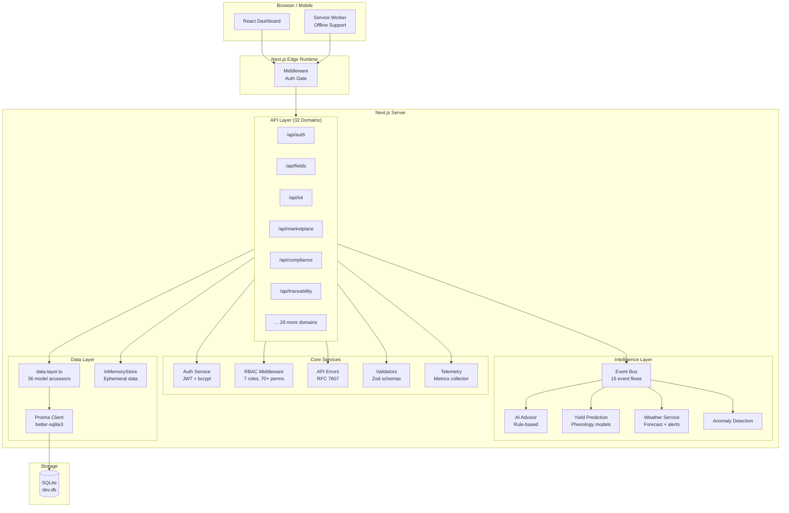
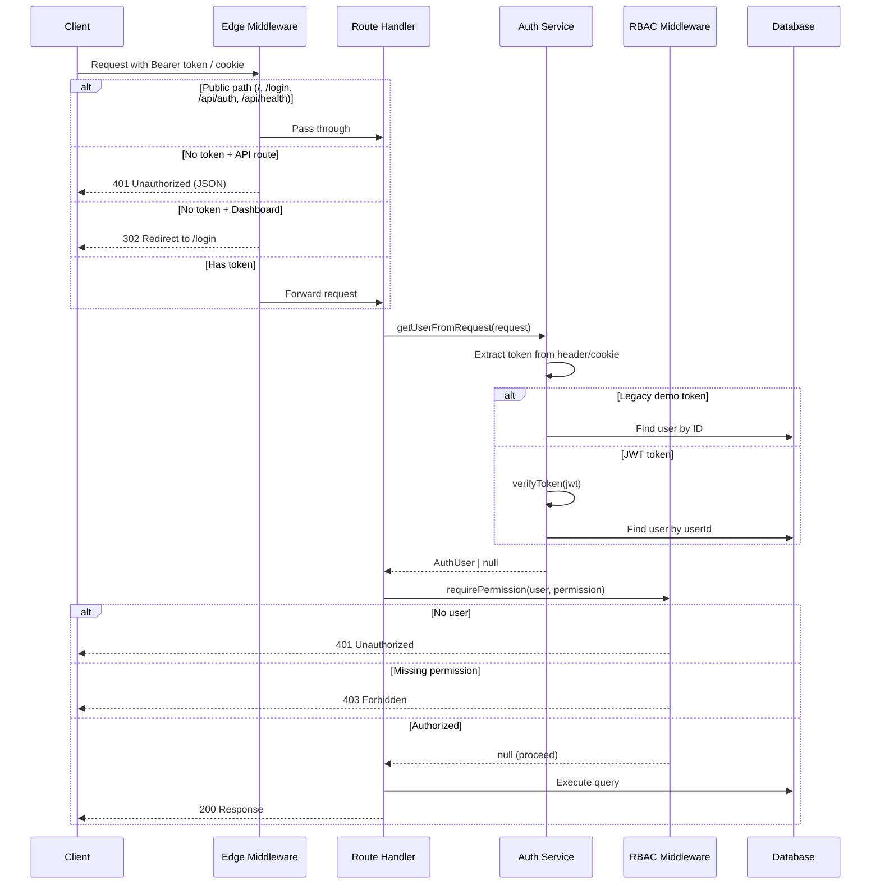
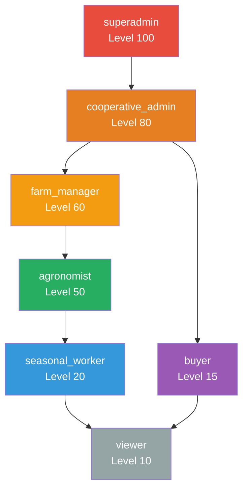
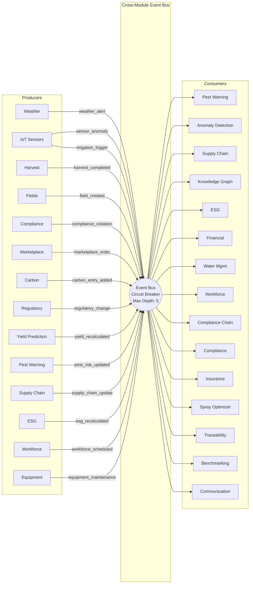
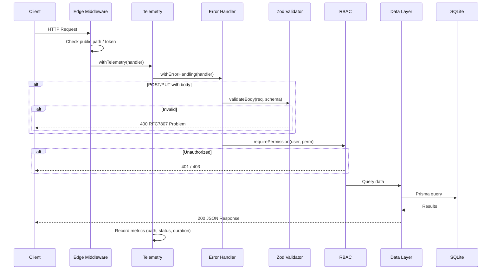
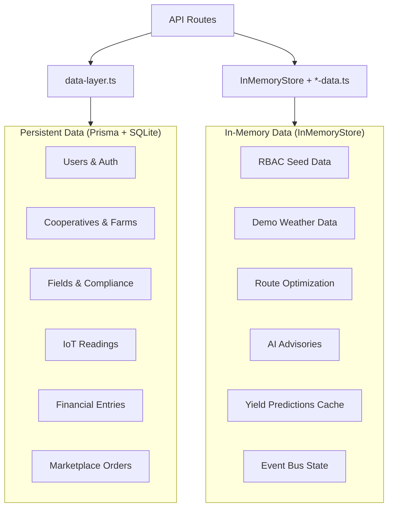
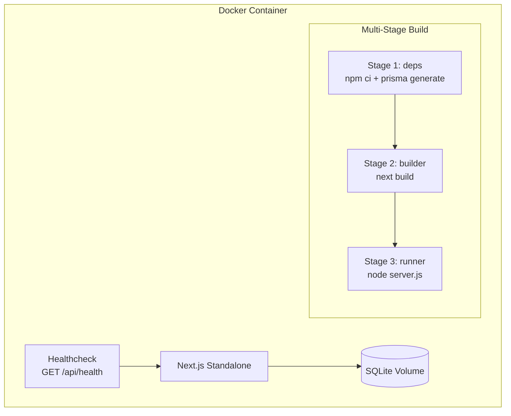

# Architecture Overview

AgriRomagna is a full-stack Next.js 16 application using the App Router pattern. It serves both a React-based dashboard UI and a comprehensive REST API, all backed by SQLite through Prisma ORM.

---

## System Architecture



---

## Authentication & Authorization Flow



### JWT Token Lifecycle

| Token | Expiry | Purpose |
|-------|--------|---------|
| Access Token | 15 minutes | API request authentication |
| Refresh Token | 7 days | Renew access tokens without re-login |

### RBAC Role Hierarchy



**Permission count by role:**
- `superadmin` — all 70+ permissions (read + write)
- `cooperative_admin` — all read + most write (no `rbac:write`, `users:write`)
- `farm_manager` — farm-scope read/write
- `agronomist` — field-scope agronomic features
- `seasonal_worker` — harvest, mobile, communication
- `buyer` — marketplace, traceability
- `viewer` — dashboard, fields, weather, satellite, marketplace (read-only)

---

## Data Model

### Entity Relationship Overview

```mermaid
erDiagram
    Cooperative ||--o{ User : "has members"
    Cooperative ||--o{ Farm : "contains"
    Cooperative ||--o{ ESGIndicator : "tracks"
    Cooperative ||--o{ SeasonalWorker : "employs"
    Cooperative ||--o{ Proposal : "governs"
    Cooperative ||--o{ CommunicationChannel : "communicates"

    Farm ||--o{ Field : "has"
    Farm ||--o{ User : "assigned to"
    Farm ||--o{ CostEntry : "tracks costs"
    Farm ||--o{ RevenueEntry : "tracks revenue"
    Farm ||--o{ CarbonEntry : "carbon accounting"
    Farm ||--o{ Equipment : "owns"
    Farm ||--o{ MarketplaceProduct : "sells"
    Farm ||--o{ InsurancePolicy : "insured by"
    Farm ||--o{ FarmBenchmark : "benchmarked"

    Field ||--o{ ComplianceRecord : "regulated by"
    Field ||--o{ ComplianceEvent : "events"
    Field ||--o{ ProductLot : "produces"
    Field ||--o{ SensorDevice : "monitored by"
    Field ||--o{ NDVIReading : "satellite data"
    Field ||--o{ CostEntry : "field costs"
    Field ||--o{ CarbonEntry : "field carbon"
    Field ||--o{ HarvestDeclaration : "harvested"
    Field ||--o{ IrrigationSchedule : "irrigated"
    Field ||--o{ SoilAnalysis : "analyzed"
    Field ||--o{ SprayPrescription : "treated"
    Field ||--o{ WorkShift : "worked on"
    Field ||--o{ YieldPrediction : "predicted"
    Field ||--o{ SimulationScenario : "simulated"

    User ||--o{ Proposal : "creates"
    User ||--o{ Vote : "votes"
    User ||--o{ Order : "buys"
    User ||--o{ Message : "sends"
    User ||--o{ SimulationScenario : "simulates"

    ProductLot ||--o{ TraceabilityEvent : "traced"
    SensorDevice ||--o{ SensorReading : "reads"
    Equipment ||--o{ MaintenanceEvent : "maintained"
    SeasonalWorker ||--o{ WorkShift : "works"
    Proposal ||--o{ Vote : "receives"
    MarketplaceProduct ||--o{ Order : "ordered"
    CommunicationChannel ||--o{ Message : "contains"
    ComplianceRecord ||--o{ ComplianceEvent : "has events"
```



### Model Count by Domain

| Domain | Models | Key Tables |
|--------|--------|------------|
| Core | 4 | User, Cooperative, Farm, Field |
| Compliance | 2 | ComplianceRecord, ComplianceEvent |
| Traceability | 2 | ProductLot, TraceabilityEvent |
| IoT | 3 | SensorDevice, SensorReading, NDVIReading |
| Financial | 3 | CostEntry, RevenueEntry, FarmBenchmark |
| Carbon & ESG | 2 | CarbonEntry, ESGIndicator |
| Water & Soil | 2 | IrrigationSchedule, SoilAnalysis |
| Crop Protection | 2 | DiseaseRisk, SprayPrescription |
| Equipment | 2 | Equipment, MaintenanceEvent |
| Workforce | 3 | SeasonalWorker, WorkShift, HarvestDeclaration |
| Governance | 2 | Proposal, Vote |
| Marketplace | 2 | MarketplaceProduct, Order |
| Logistics | 1 | SupplyChainLot |
| Communication | 2 | CommunicationChannel, Message |
| Insurance | 1 | InsurancePolicy |
| Predictions | 2 | YieldPrediction, SimulationScenario |
| Regulatory | 1 | RegulatoryUpdate |

**Total: 36 models**

---

## Cross-Module Event Bus

The event bus implements a publish-subscribe pattern connecting modules via 15 predefined event flows. It includes circuit breaker logic and recursion depth limits.



### Event Flow Chains

Some events cascade through the system:

```
weather_alert → pest_risk_updated → spray_optimizer
harvest_completed → supply_chain_update → traceability
compliance_violation → esg_recalculated → benchmarking + federation
carbon_entry_added → esg_recalculated → benchmarking + federation
marketplace_order → yield_recalculated → financial + insurance
```

---

## Request Lifecycle



---

## Dual Data Architecture

The application uses two data strategies:



**Design rationale:** Core business entities use Prisma for durability. Feature-specific computed data, seed data for demos, and caches use `InMemoryStore<T>` for fast access and zero-migration iteration.

---

## Deployment Architecture



- **Base image:** `node:20-alpine`
- **Port:** 3000
- **Healthcheck:** `GET /api/health` every 30s
- **Data persistence:** Docker volume `app-data`

---

## Module Map

The 45+ library modules in `src/lib/` are organized by concern:

| Category | Modules |
|----------|---------|
| **Auth & Access** | `auth-service.ts`, `auth.ts`, `rbac-middleware.ts`, `rbac-data.ts` |
| **Data Access** | `prisma.ts`, `data-layer.ts`, `db.ts`, `data.ts` |
| **API Infrastructure** | `api-errors.ts`, `telemetry.ts`, `event-bus.ts` |
| **Validation** | `validators/schemas.ts` |
| **Intelligence** | `ai-advisor.ts`, `intelligence-fabric.ts`, `moonshot-operating-system.ts` |
| **Predictions** | `yield-prediction.ts`, `weather-service.ts`, `route-optimizer.ts` |
| **Domain Data** | 25+ `*-data.ts` files (carbon, compliance, equipment, financial, etc.) |
| **Utilities** | `utils.ts`, `onboarding-service.ts` |
