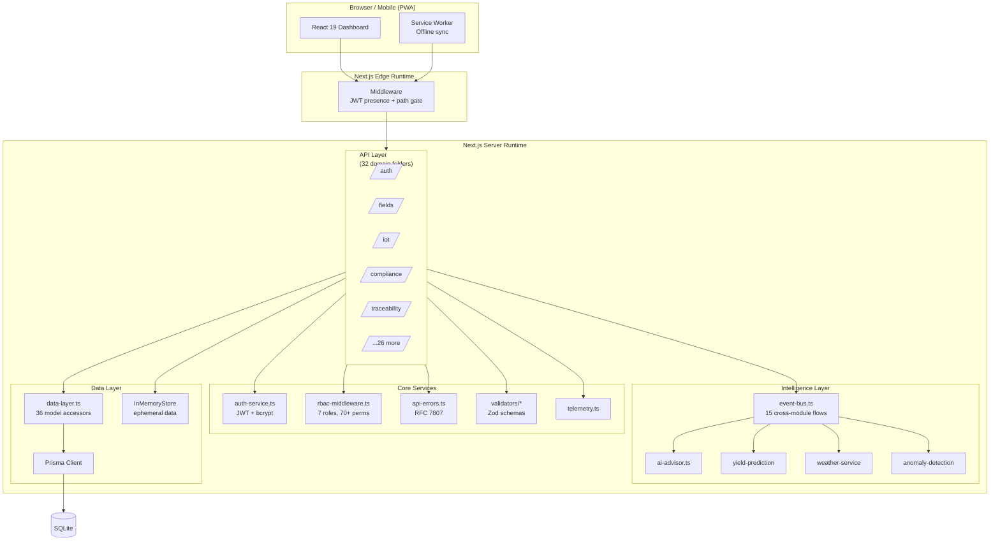
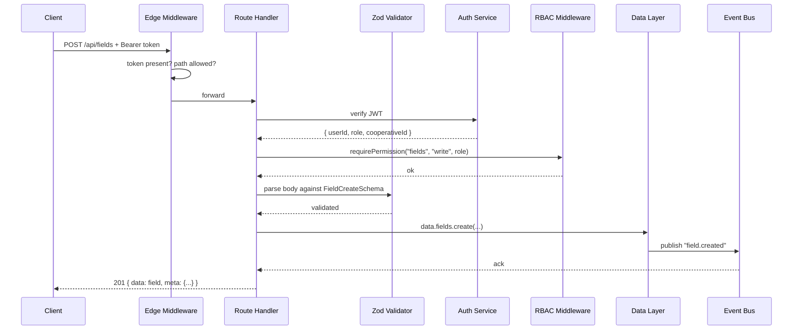

# Architecture

AgriRomagna is a single Next.js 16 application using the **App Router**. It serves both the React dashboard UI and the entire REST API, backed by SQLite through Prisma 7. There is no separate backend service.

## System overview



## Request lifecycle

A typical authenticated request to `POST /api/fields`:



## Why this shape

### One process, two surfaces

The dashboard and the API live in the same Next.js process. There is no internal HTTP boundary. This keeps the local dev story trivial (`npm run dev`) and removes a class of distributed-system bugs that have no business showing up in a single-tenant cooperative deployment.

When you outgrow a single process (>100 cooperatives, multi-region), the data layer is the seam: swap `data-layer.ts` for a service client and split the API out.

### Edge middleware as a thin gate

`src/middleware.ts` only checks **token presence and the allow-list of public paths**. It does not verify signatures. Why?

- Edge runtime can't use `bcrypt` or full Node crypto reliably across hosts.
- A token can be expired but present; the route handler still has to verify it.
- Centralizing all auth in the route handler makes RBAC and JWT verification testable in one place.

So the middleware is a fast path-and-presence gate; the route handler is the real authority.

### Data layer over raw Prisma calls

Route handlers don't call `prisma.field.create()` directly. They call `data.fields.create()`. This single indirection buys:

- A consistent place to add telemetry, soft-delete, audit logging.
- A natural shim for `InMemoryStore<T>` — used for ephemeral demo data and tests.
- An obvious extraction point if you later split the API into a service.

See [Data Layer](./data-layer.md) for the full pattern.

### Event bus for cross-module coordination

When you create a field, several modules need to react: compliance opens an audit subscription, the AI advisor recomputes recommendations, the carbon ledger sets a baseline. Coupling all of that into the field route handler is unmaintainable.

Instead, the route handler publishes `field.created` and 15+ subscribers across modules react. See [Event Bus](./event-bus.md).

## Code layout

```text
agri-romagna/
├── prisma/
│   ├── schema.prisma          # 36 data models
│   ├── migrations/
│   └── seed.ts                # Demo data
├── src/
│   ├── app/
│   │   ├── api/               # ~50 route handlers in 32 domain folders
│   │   ├── dashboard/         # Protected dashboard pages
│   │   ├── login/
│   │   ├── onboarding/
│   │   └── traceability/      # Public QR pages
│   ├── components/
│   ├── lib/                   # 45+ business-logic modules
│   │   ├── auth-service.ts
│   │   ├── rbac-middleware.ts
│   │   ├── data-layer.ts
│   │   ├── event-bus.ts
│   │   ├── api-errors.ts
│   │   ├── telemetry.ts
│   │   └── validators/
│   ├── generated/             # Prisma client output
│   └── middleware.ts          # Edge auth gate
├── tests/                     # Vitest — 67 tests, 8 suites
└── Dockerfile                 # Multi-stage production image
```

## Trade-offs we accept

| Choice | What we give up | What we gain |
|---|---|---|
| SQLite via `better-sqlite3` | Horizontal write scaling | Zero ops; great for per-cooperative deployments; fast local dev |
| Single Next.js process | Independent scaling of API vs UI | One deploy unit; shared types; simple local dev |
| Event bus in-memory | Cross-process pub/sub | Synchronous, ordered, testable |
| Edge middleware as gate only | "Free" JWT verification at the edge | Portable to any Node host |

When these trade-offs stop fitting, the seams are explicit and the extraction targets are obvious.

## Next

- [Multi-tenancy](./multi-tenancy.md) — how cooperatives are isolated.
- [RBAC](./rbac.md) — roles, permissions, and how route handlers enforce them.
- [Data layer](./data-layer.md) — the Prisma indirection.
- [Event bus](./event-bus.md) — cross-module flows.
- [Offline-first](./offline-first.md) — PWA and sync strategy.
