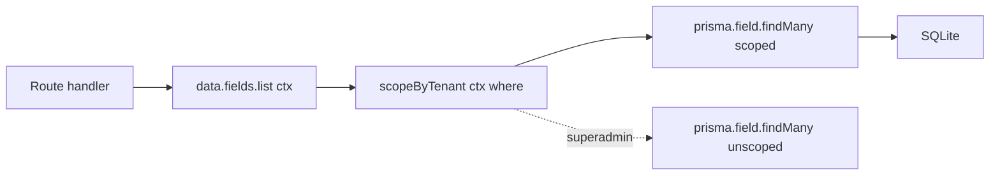

# Data Layer

Route handlers in AgriRomagna never call Prisma directly. They go through `src/lib/data-layer.ts`, which exposes a typed accessor per Prisma model.

## Why an indirection

A single line of indirection buys five things:

1. **Tenant scoping** — every query is automatically filtered by `cooperativeId` / `farmId` from the request context.
2. **Telemetry** — query counts, slow-query logging, feature heatmap.
3. **Soft delete** — `deletedAt` is filtered out by default; pass `{ includeDeleted: true }` to opt in.
4. **In-memory shim** — `InMemoryStore<T>` is interchangeable with the Prisma-backed accessor, used for tests and ephemeral demo data.
5. **Extraction seam** — when you outgrow a single process, swap `data` for an HTTP client without touching route handlers.

## Shape

```ts title="src/lib/data-layer.ts"
export const data = {
  fields: {
    list: (ctx: RequestContext, where?: FieldFilter) => /* ... */,
    findById: (ctx: RequestContext, id: string) => /* ... */,
    create: (ctx: RequestContext, input: FieldCreateInput) => /* ... */,
    update: (ctx: RequestContext, id: string, patch: FieldUpdateInput) => /* ... */,
    softDelete: (ctx: RequestContext, id: string) => /* ... */,
  },
  farms: { /* ... */ },
  cooperatives: { /* ... */ },
  // ... 33 more model accessors, one per Prisma model
};
```

There are **36 model accessors**, one per Prisma model in `prisma/schema.prisma`.

## InMemoryStore

For data that is intentionally non-durable — demo dashboards, simulations, transient telemetry buffers — AgriRomagna uses `InMemoryStore<T>`:

```ts title="src/lib/db.ts (simplified)"
export class InMemoryStore<T extends { id: string }> {
  private items = new Map<string, T>();
  list(filter?: (t: T) => boolean): T[] { /* ... */ }
  findById(id: string): T | null { /* ... */ }
  create(item: T): T { /* ... */ }
  update(id: string, patch: Partial<T>): T { /* ... */ }
  delete(id: string): boolean { /* ... */ }
}
```

It implements the same surface as the Prisma-backed accessors. In tests, modules under test can be wired to `InMemoryStore` without spinning up SQLite.

## Tenant scoping in practice



`scopeByTenant`:

- For `superadmin`: returns the user-supplied `where` unchanged.
- For everyone else: ANDs the `where` with `{ farm: { cooperativeId: ctx.cooperativeId } }`.
- For `farm_manager` and below: also ANDs `{ farmId: ctx.farmId }` when the resource is farm-scoped.

This is the **single place** tenant boundaries live. Tested in `tests/lib/db.test.ts`.

## Adding a new accessor

Suppose you add an `Apiary` model to track beehives:

1. Add the model to `prisma/schema.prisma`, including `farmId` and `cooperativeId` keys.
2. Run `npm run db:migrate -- --name add_apiary`.
3. Add an accessor to `data-layer.ts`:

   ```ts
   export const data = {
     // ...
     apiaries: {
       list: (ctx) => prisma.apiary.findMany({
         where: scopeByTenant(ctx, {}),
       }),
       create: (ctx, input) => prisma.apiary.create({
         data: { ...input, cooperativeId: ctx.cooperativeId, farmId: ctx.farmId },
       }),
     },
   };
   ```

4. Write your route handler against `data.apiaries.*`, never `prisma.apiary.*`.

## Soft delete

Soft delete is opt-in per model. Models with a `deletedAt: DateTime?` column get automatic filtering:

```ts
await data.fields.list(ctx);                          // hides deleted
await data.fields.list(ctx, { includeDeleted: true }); // includes them
await data.fields.softDelete(ctx, fieldId);            // sets deletedAt
```

Hard delete is only exposed via `data.<model>.hardDelete()` and is restricted to `superadmin` by the RBAC layer.

## Observability

Every `data.*` call publishes a structured telemetry event:

```json
{
  "ev": "data.query",
  "model": "fields",
  "op": "list",
  "ctx": { "cooperativeId": "...", "role": "farm_manager" },
  "durationMs": 4,
  "rows": 12
}
```

These feed `/api/analytics` and the request/feature heatmap in the dashboard.
