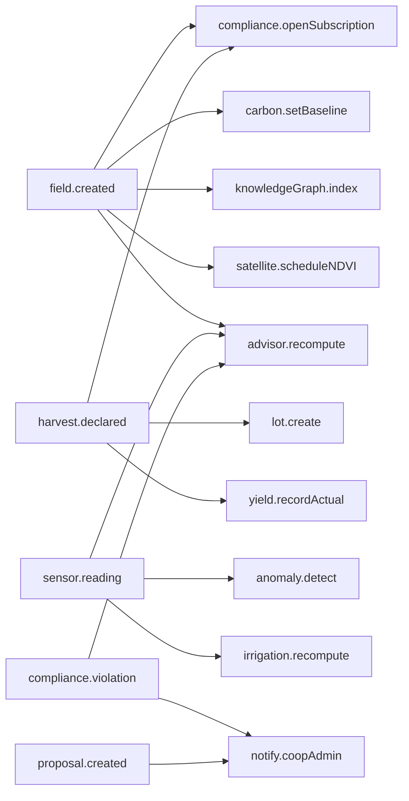
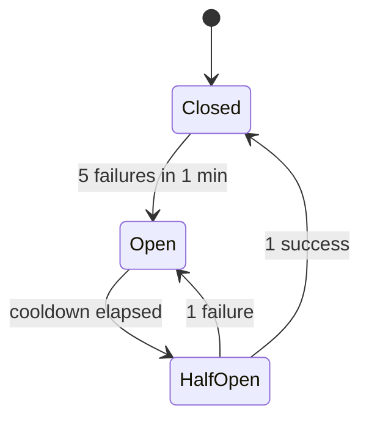

# Event Bus

The event bus is how independent modules in AgriRomagna stay decoupled. When a field is created, a sensor reading arrives, or a harvest is declared, the originating route handler **publishes** an event. Other modules subscribe and react.

This is the same pattern used by domain-driven systems like Stripe's webhooks — but kept in-process for now because every subscriber runs in the same Next.js process.

## Why an event bus, not direct calls?

The "create a field" flow needs to:

- open a compliance audit subscription;
- initialize a carbon-accounting baseline;
- index the field in the knowledge graph;
- schedule a first NDVI satellite pull;
- notify the AI advisor.

If the field route handler had to call all five, you'd get a 200-line function and a brittle coupling graph. With the bus, the route handler is **five lines** and the five subscribers each live next to the module they belong to.

## Shape

```ts title="src/lib/event-bus.ts"
type EventName =
  | "field.created" | "field.updated" | "field.deleted"
  | "harvest.declared"
  | "sensor.reading"
  | "compliance.violation"
  | "lot.created" | "lot.shipped" | "lot.delivered"
  | "carbon.entry.added"
  | "proposal.created" | "vote.cast"
  | "anomaly.detected"
  | "user.invited"
  | "weather.alert";

interface BusEvent<T = unknown> {
  name: EventName;
  payload: T;
  ctx: RequestContext;
  occurredAt: string;   // ISO timestamp
  correlationId: string;
}

eventBus.publish("field.created", { field, ctx });
eventBus.subscribe("field.created", async (evt) => { /* ... */ });
```

## Documented flows

There are 15 event flows wired up out of the box. The most important:



## Circuit breaker

A subscriber that throws repeatedly will be **opened** by the bus and skipped until it cools down. This prevents one buggy subscriber from blocking every event in the system.

```ts
eventBus.subscribe("sensor.reading", flakySubscriber, {
  retries: 3,
  circuitBreaker: { threshold: 5, cooldownMs: 60_000 },
});
```

State transitions:



Test coverage is in `tests/lib/event-bus.test.ts`.

## Ordering and synchrony

The bus delivers events **synchronously and in publish order**, awaiting each subscriber. This is intentional:

- It keeps the request lifecycle predictable — the response is sent only after subscribers have run.
- It makes tests deterministic.
- It's fast enough at the per-cooperative scale we target.

When you outgrow that, the seam is the `publish` call — swap the in-process implementation for an outbox-pattern queue (e.g. PostgreSQL `LISTEN/NOTIFY` or a real broker) without touching subscribers.

## Subscribing in your own module

```ts title="src/lib/my-module.ts"
import { eventBus } from "@/lib/event-bus";

eventBus.subscribe("harvest.declared", async (evt) => {
  // evt.payload is typed via the EventPayloadMap
  const { harvest, ctx } = evt.payload;
  await myCustomLogic(harvest, ctx);
});
```

Subscribers should be **idempotent**. The bus guarantees at-least-once delivery within the process, but a future durable backend would expose retries to your handler.
