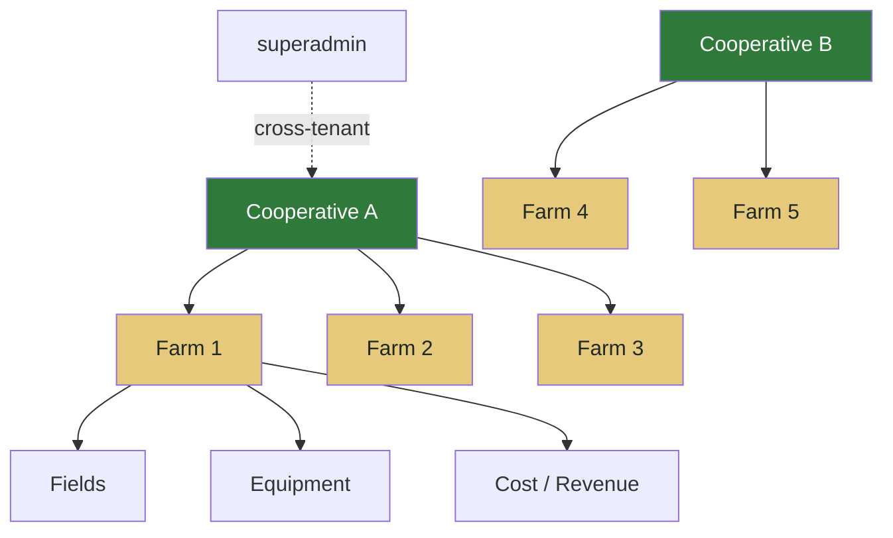

# Multi-Tenancy

AgriRomagna is **multi-tenant by row**, not by database. Every record carries a `cooperativeId` (and, for farm-level data, a `farmId`). Tenant isolation is enforced in the data layer and verified at every route handler.

## The tenancy hierarchy



There are three logical tenant levels:

1. **Cooperative** — the top-level tenant. Owns members, governance, compliance and marketplace settings.
2. **Farm** — a sub-tenant inside a cooperative. Owns fields, equipment, financial records.
3. **User** — belongs to exactly one cooperative (and optionally one farm), except `buyer` and `superadmin`.

## Enforcement at three layers

### 1. Schema — required foreign keys

```prisma
model Farm {
  id            String  @id @default(cuid())
  cooperativeId String
  cooperative   Cooperative @relation(fields: [cooperativeId], references: [id])
  // ...
  @@index([cooperativeId])
}

model Field {
  id        String @id @default(cuid())
  farm      Farm   @relation(fields: [farmId], references: [id])
  farmId    String
  // ...
}
```

Every business object descends from a `Cooperative`. There are no "global" records except `User` (which still has an optional `cooperativeId`).

### 2. Data layer — automatic scoping

Route handlers receive a `requestContext` containing `{ userId, role, cooperativeId, farmId }` from the JWT. The data layer accepts this context and scopes queries:

```ts title="src/lib/data-layer.ts (simplified)"
export const data = {
  fields: {
    list: (ctx: RequestContext) =>
      prisma.field.findMany({
        where: scopeByTenant(ctx, { farm: { cooperativeId: ctx.cooperativeId } }),
      }),
    create: (ctx: RequestContext, input: FieldCreateInput) =>
      prisma.field.create({
        data: { ...input, farm: { connect: { id: requireFarm(ctx, input.farmId) } } },
      }),
  },
};
```

`scopeByTenant` is a no-op for `superadmin` and a required filter for everyone else.

### 3. Route handler — explicit checks

Even with the data layer scoping, route handlers do an explicit check before mutating cross-farm data — for example, a `cooperative_admin` editing a farm they don't own should get a `403`, not a silent no-op.

```ts
const farm = await data.farms.findById(ctx, farmId);
if (!farm) throw apiErrors.notFound("Farm not found");
if (farm.cooperativeId !== ctx.cooperativeId && ctx.role !== "superadmin") {
  throw apiErrors.forbidden("Not your cooperative");
}
```

## What about cross-tenant features?

A few features are intentionally cross-tenant:

- **Federation** (`/api/federation`) — opt-in data sharing between cooperatives for benchmarking.
- **Marketplace** — buyers see products from any cooperative that lists them.
- **Public traceability pages** (`/traceability/[lotId]`) — anyone with a QR code can view the supply chain story.

These endpoints either require explicit opt-in (federation), filter by a public flag (marketplace, traceability), or are entirely unauthenticated and read-only (public lot pages).

## Deployment isolation

If row-level isolation is not enough for your regulatory environment, AgriRomagna also supports **one cooperative per deployment**. With SQLite as the default database, spinning up a dedicated instance per cooperative is cheap:

```bash
DATABASE_URL="file:./coop-vigne-romagna.db" \
JWT_SECRET="$(openssl rand -hex 32)" \
docker compose up -d
```

Each instance gets its own database file, JWT secret, and process. See [Docker operations](../operations/docker.md).
