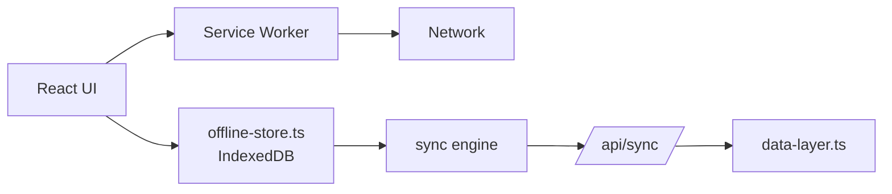

# Offline-First & PWA

Fields in Romagna's hills routinely lose 4G coverage. An app that requires connectivity to log a treatment is an app that nobody logs treatments in. AgriRomagna is designed to **always work**, online or off, and reconcile when connectivity returns.

## What works offline

| Capability | Offline | Notes |
|---|---|---|
| View previously-loaded fields, lots, sensors | ✅ | Cached in IndexedDB |
| Log a new field-journal entry | ✅ | Queued for sync |
| Take photos with GPS | ✅ | Stored locally, uploaded on reconnect |
| Mark a harvest declaration | ✅ | Conflict-checked on sync |
| View live sensor readings | ⚠️ | Last cached value, with timestamp |
| Marketplace order placement | ❌ | Requires connectivity (price & stock) |
| Sign in (first time) | ❌ | Requires server; after that, refresh tokens are cached |

## Architecture



The dashboard is a **PWA**:

- `public/manifest.json` declares the app for installation.
- `public/sw.js` is the service worker — pre-caches the app shell, runtime-caches API responses with a stale-while-revalidate policy.
- `src/lib/offline-store.ts` is the IndexedDB-backed local store.
- `POST /api/sync` accepts a batch of queued mutations on reconnect.

## Conflict strategy

When two devices edit the same record while one was offline, the server uses **last-writer-wins per field**, with two exceptions:

1. **Append-only collections** (field journal, sensor readings, traceability events) **never conflict** — both writes are kept.
2. **Compliance audit packages** are **immutable** once submitted. A late offline edit is rejected with `409 Conflict` and surfaced in a "review changes" UI.

## Installing the PWA

From any modern browser, open the dashboard and choose **Install AgriRomagna** from the URL bar or the app menu. On iOS Safari, use **Share → Add to Home Screen**.

After installation, the app launches in a standalone window, full screen on mobile, and remains usable offline.

## Disabling the service worker for development

The service worker only registers in production builds (`npm run build && npm run start`). In `npm run dev` it is intentionally disabled to avoid stale-cache headaches.

To test offline behavior locally:

```bash
npm run build
npm run start
# Then in Chrome DevTools → Application → Service Workers → enable "Offline"
```

## Sync API surface

The minimum you need to know to integrate a third-party mobile client:

```http
POST /api/sync
Authorization: Bearer <token>
Content-Type: application/json

{
  "since": "2026-05-18T08:00:00Z",
  "mutations": [
    { "id": "local-1", "type": "field.journal.create", "payload": { ... } },
    { "id": "local-2", "type": "sensor.reading.create", "payload": { ... } }
  ]
}
```

Response:

```json
{
  "applied": [
    { "localId": "local-1", "serverId": "evt_...", "status": "ok" },
    { "localId": "local-2", "serverId": "evt_...", "status": "ok" }
  ],
  "conflicts": [],
  "serverChanges": [ /* records updated since "since" */ ]
}
```

See the [API reference → Mobile / Sync](../reference/api.md) for the full schema.
