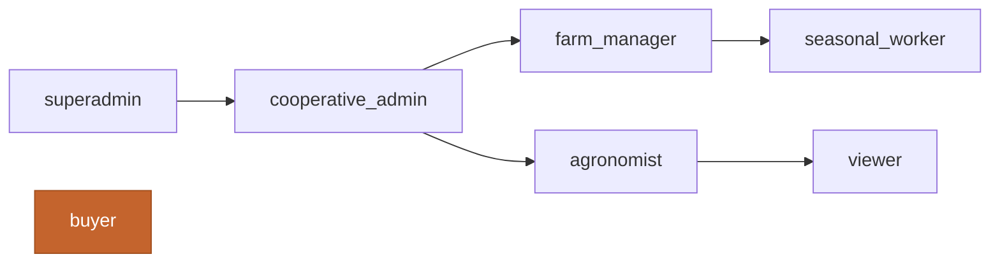

# Demo Users & Logins

After running `npm run db:seed`, the platform contains thirteen demo users spanning every role and three cooperatives. All demo users share the same local-only password: **`demo`**.

:::danger Local only
These accounts exist only after running the seed script against a local SQLite database. **Never deploy a production instance with seed data.** The seeded password hashes are intentionally weak so the auth flow is testable.
:::

## Cooperative: Vigne di Romagna (Forlì-Cesena, wine)

| Email | Role | Use it to |
|---|---|---|
| `superadmin@agriromagna.demo` | `superadmin` | Cross-cooperative admin, billing, federation |
| `elena.bellini@vignediromagna.it` | `cooperative_admin` | Manage co-op members, approve proposals, run audits |
| `marco.tondini@tondini.it` | `farm_manager` | Manage a single farm and its fields |
| `lucia.giorgi@agriromagna.demo` | `agronomist` | Read-write on crops, treatments, pest warnings |
| `simone.verdi@agriromagna.demo` | `viewer` | Read-only access to co-op data |

## Cooperative: Terre Faentine Bio (Ravenna, organic)

| Email | Role |
|---|---|
| `giacomo.rossi@terrefaentine.it` | `cooperative_admin` |
| `sara.monti@ca-bianca.it` | `farm_manager` |
| `marta.neri@agriromagna.demo` | `viewer` |

## Cooperative: Ortofrutta Adriatica Romagnola (Ravenna, fruit & veg)

| Email | Role |
|---|---|
| `paolo.rinaldi@orto-adriatico.it` | `cooperative_admin` |
| `anna.bassi@pineta-verde.it` | `farm_manager` |
| `lorenzo.ferri@agriromagna.demo` | `viewer` |

## External buyers (marketplace)

These accounts are not tied to a cooperative — they exist to test the marketplace and order flow.

| Email | Role |
|---|---|
| `davide.costa@agriromagna.demo` | `buyer` |
| `chiara.romani@agriromagna.demo` | `buyer` |

## What each role can do

For the full permissions matrix, see [Roles & Permissions](../reference/roles-and-permissions.md).

A short version:



- `superadmin` — everything across all cooperatives.
- `cooperative_admin` — full access within their cooperative.
- `farm_manager` — full access within their farm.
- `agronomist` — read-write on agronomic data, read-only on financial.
- `seasonal_worker` — write on workforce shifts, read on assigned fields.
- `viewer` — read-only.
- `buyer` — marketplace and orders only.

## Resetting demo data

```bash
npm run db:reset
```

This drops the SQLite database, re-runs all migrations and re-seeds. Useful when an experiment leaves the data in a weird state.
