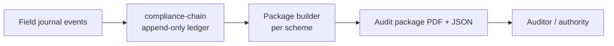

# Compliance & Audits

EU agriculture is regulation-heavy by design. Organic certification, DOP/IGP origin protection and CAP subsidy reporting all require **continuous documentation** — not a sprint at audit time. AgriRomagna turns the daily field journal into audit-ready packages automatically.

## What's covered out of the box

| Scheme | Standard | Output |
|---|---|---|
| Organic | EU Reg. 2018/848 | Operator log, input register, conversion timeline |
| DOP/IGP | Disciplinari di produzione | Production chain documentation per spec |
| CAP / AGEA | National implementation | Hectare declarations, treatment register, eco-scheme proof |
| GLOBAL G.A.P. | v6 (IFA) | Checklist crosswalk + evidence index |
| Digital Product Passport | EU 2024/1781 | Per-lot DPP in JSON-LD (preview) |

## How it works

Every `field.journal.*` event is tagged with the compliance schemes that apply to it. When you open the compliance dashboard, AgriRomagna **rebuilds** the relevant packages from the source events:



The compliance-chain ledger is **append-only and hash-linked** — every event references the hash of the previous event. Tampering is detectable and provable.

## Build an audit package

```bash
curl -X POST http://localhost:3000/api/compliance/packages \
  -H "Authorization: Bearer $TOKEN" \
  -d '{
    "scheme": "organic",
    "scope": { "farmId": "farm_clz123" },
    "period": { "from": "2026-01-01", "to": "2026-12-31" },
    "format": ["pdf", "jsonld"]
  }'
```

Response:

```json
{
  "package": {
    "id": "pkg_clz789",
    "scheme": "organic",
    "status": "ready",
    "url": "/api/compliance/packages/pkg_clz789/download",
    "summary": {
      "events": 412,
      "fields": 7,
      "missing_required": [],
      "warnings": [
        "Photo evidence missing for treatment evt_clz... (2026-06-12)"
      ]
    }
  }
}
```

A package with `missing_required.length > 0` cannot be submitted — the dashboard surfaces exactly which fields and dates are missing data.

## Compliance violations

When a journal entry conflicts with a scheme rule (e.g. an unauthorized pesticide on an organic field), a `compliance.violation` event fires immediately. The cooperative admin is notified, and the violation is included in the next package with full provenance.

```ts
eventBus.subscribe("compliance.violation", async (evt) => {
  await notify.coopAdmin(evt.ctx.cooperativeId, {
    type: "compliance.violation",
    severity: evt.payload.severity,
    field: evt.payload.fieldId,
    rule: evt.payload.rule,
    journalEvent: evt.payload.journalEventId,
  });
});
```

## Regulatory radar

The platform tracks upcoming EU and Italian regulatory changes (`/api/regulatory-radar`) and warns when a planned change will affect your current operations. For example: a new active-ingredient ban triggers a flag on every field still using the product.

## Digital Product Passport (preview)

The EU Digital Product Passport regulation (2024/1781) will require per-product traceability data for many product categories. AgriRomagna's DPP exporter generates a JSON-LD document conforming to the draft schema:

```bash
curl -H "Authorization: Bearer $TOKEN" \
  "http://localhost:3000/api/compliance/dpp?lotId=$LOT_ID&format=jsonld"
```

DPP support is marked preview because the final schema is still in consultation. It will move to stable in 0.4.

## See also

- [Traceability](./traceability.md) — the supply-chain layer DPP plugs into.
- [Reference: Compliance API](../reference/api.md#compliance) — every endpoint.
