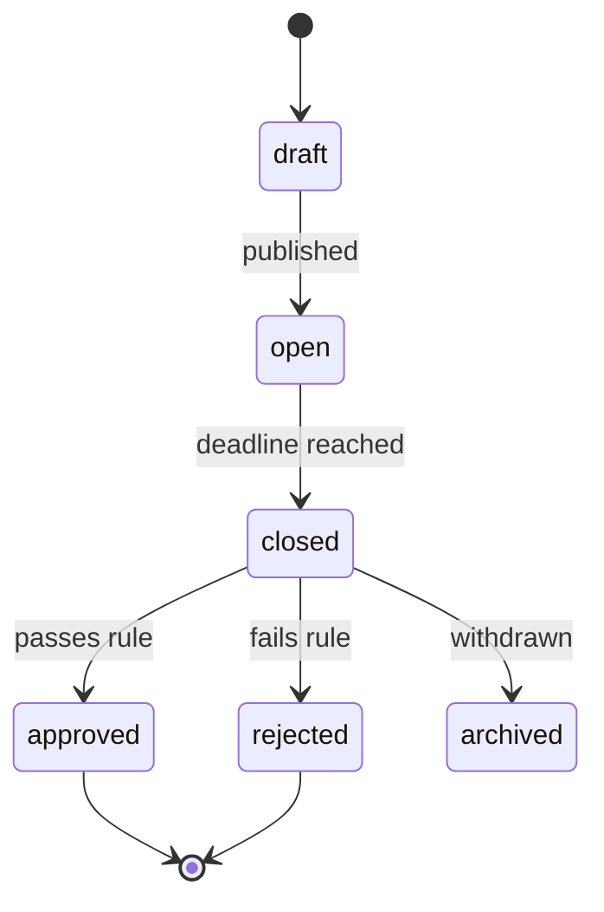

# Governance & Voting

Italian cooperatives are democratic by law: every member has voting rights, and major decisions require formal assembly votes. AgriRomagna ships a governance module that turns that process from a stack of PDFs into a queryable, auditable record.

## What it does

- Create and circulate **proposals** with attachments and a discussion thread.
- Configure **voting rules**: simple majority, supermajority, quorum, deadline.
- Support **weighted votes** (e.g. by hectares, by membership tier) where the cooperative's statute allows.
- Produce **signed meeting minutes** the cooperative can file with the registry.

## Lifecycle



## Create a proposal

```bash
curl -X POST http://localhost:3000/api/governance/proposals \
  -H "Authorization: Bearer $TOKEN" \
  -d '{
    "title": "Adoption of EU organic certification across all member farms",
    "summary": "Mandates conversion to certified organic over 3 years for all member farms growing wine grapes.",
    "category": "compliance",
    "rule": {
      "type": "supermajority",
      "threshold": 0.66,
      "quorum": 0.5,
      "weighting": "hectares"
    },
    "deadline": "2026-11-30T18:00:00Z",
    "attachments": ["doc_clz...", "doc_clz..."]
  }'
```

Only `cooperative_admin` (and `superadmin`) can create proposals. Permission is enforced by [RBAC](../concepts/rbac.md).

## Cast a vote

```bash
curl -X POST http://localhost:3000/api/governance/votes \
  -H "Authorization: Bearer $TOKEN" \
  -d '{
    "proposalId": "prop_clz...",
    "choice": "yes",
    "rationale": "Aligned with our 2030 sustainability plan."
  }'
```

Votes are:

- **One per member per proposal.** A change before the deadline replaces the previous vote, with an audit-log entry.
- **Signed** with the member's account — non-repudiable.
- **Weighted on tally**, never on the raw record. The raw vote always shows the member's voice.

## Outcome

When the deadline passes, the platform computes the outcome against the rule and produces a tally:

```json
{
  "proposalId": "prop_clz...",
  "status": "approved",
  "tally": {
    "yes": { "votes": 18, "weight_pct": 71.4 },
    "no":  { "votes": 7,  "weight_pct": 22.1 },
    "abstain": { "votes": 4, "weight_pct": 6.5 }
  },
  "quorum": { "required": 0.5, "actual": 0.92, "met": true },
  "threshold": { "required": 0.66, "actual": 0.714, "met": true }
}
```

A signed PDF of the meeting minutes is generated and stored as a compliance document.

## Why in-platform

A cooperative running governance on email, WhatsApp and PDFs has no defensible audit trail. Putting it inside AgriRomagna means:

- Votes are tied to authenticated identities.
- Tally rules are evaluated by code, not by hand.
- Minutes are produced from the same source as the tally.
- Auditors can replay any vote at any time.

## See also

- [Concepts: RBAC](../concepts/rbac.md)
- [API: Governance](../reference/api.md#governance)
