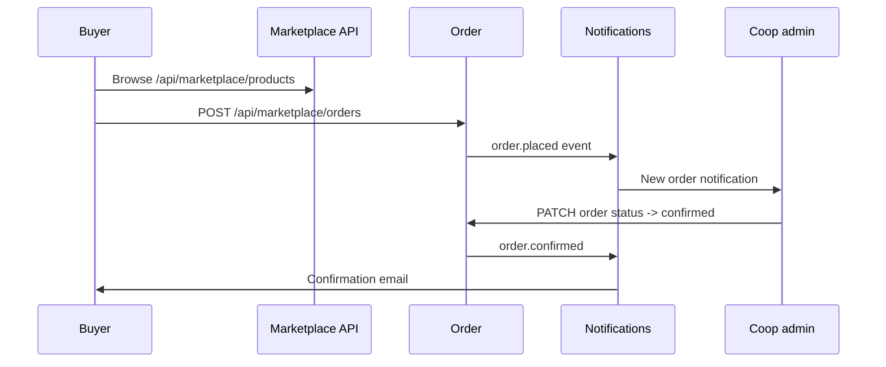

# Marketplace

The marketplace is where cooperative products become orderable B2B listings. It's tightly integrated with [traceability](./traceability.md) — every listing is backed by a product lot with a public QR page.

## List a product

```bash
curl -X POST http://localhost:3000/api/marketplace/products \
  -H "Authorization: Bearer $TOKEN" \
  -d '{
    "lotId": "lot_clz456",
    "name": "Sangiovese di Romagna DOC 2026",
    "category": "wine",
    "unit": "bottle",
    "unitSize": "0.75 L",
    "price": 8.50,
    "currency": "EUR",
    "availableQuantity": 2400,
    "minimumOrder": 24,
    "leadTimeDays": 7,
    "certifications": ["organic", "doc"]
  }'
```

The listing inherits the lot's traceability chain and certifications automatically. Buyers see the QR-backed story on the listing page.

## Buyer flow



## Place an order

```bash
curl -X POST http://localhost:3000/api/marketplace/orders \
  -H "Authorization: Bearer $TOKEN" \
  -d '{
    "productId": "prod_clz999",
    "quantity": 240,
    "deliveryAddress": {
      "company": "Ristorante La Pergola",
      "street": "Via Roma 12",
      "city": "Cesena",
      "postalCode": "47521",
      "country": "IT"
    },
    "deliveryDate": "2026-10-15"
  }'
```

Orders flow through a state machine:

```text
placed → confirmed → in_production → shipped → delivered → settled
              ↘ rejected            ↘ cancelled (with reason)
```

Each transition fires a typed event (see [event bus](../concepts/event-bus.md)).

## Benchmarking

Cooperatives can opt in to **anonymous benchmarking** — comparing their prices, yields and cost-per-hectare against the median of peers in their category and region.

```bash
curl -H "Authorization: Bearer $TOKEN" \
  "http://localhost:3000/api/benchmarking?category=wine&region=Emilia-Romagna"
```

Privacy guarantees:

- Per-cooperative numbers are never exposed to peers.
- Benchmarks are only returned when ≥ 5 cooperatives are in the bucket.
- Each cooperative sees only the bucket median, p25 and p75.

This is enforced in `src/lib/benchmarking-data.ts` and tested.

## Direct-buyer onboarding

Buyers register without a cooperative. The `buyer` role grants marketplace and orders access only — no agronomic or compliance data.

```bash
curl -X POST http://localhost:3000/api/auth \
  -H "Content-Type: application/json" \
  -d '{
    "action": "register",
    "email": "buyer@trattoria.example",
    "password": "...",
    "name": "Trattoria Sole",
    "role": "buyer"
  }'
```

## See also

- [Traceability](./traceability.md)
- [API: Marketplace](../reference/api.md#marketplace)
