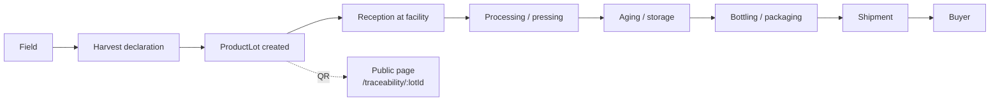

# Traceability & Product Lots

Every bottle of wine, crate of peaches and kilogram of grain produced by a cooperative becomes a `ProductLot`. AgriRomagna links each lot to the field it came from, the operations performed on it, and every supply-chain event that follows.

## The traceability chain



Each arrow is a `TraceabilityEvent` with a timestamp, operator, location, optional photos, and a hash linking back to the previous event.

## Create a lot

A lot is normally created by a harvest declaration (see [Fields & Crops](./fields-and-crops.md#declare-a-harvest)). You can also create one manually for processed products:

```bash
curl -X POST http://localhost:3000/api/supply-chain/lots \
  -H "Authorization: Bearer $TOKEN" \
  -d '{
    "name": "Albana DOCG 2026 — Bertinoro",
    "sourceFieldIds": ["fld_clz123", "fld_clz124"],
    "quantity": 4200,
    "unit": "bottles",
    "process": "vinification",
    "vintage": 2026
  }'
```

## Record a supply-chain event

```bash
curl -X POST http://localhost:3000/api/supply-chain/events \
  -H "Authorization: Bearer $TOKEN" \
  -d '{
    "lotId": "lot_clz456",
    "type": "bottling",
    "operator": "Lucia Giorgi",
    "location": "Cantina di Bertinoro",
    "quantity": 4200,
    "unit": "bottles",
    "notes": "Tappi sughero, etichette 2026."
  }'
```

A `lot.shipped` event triggers automatic notifications to the buyer (if marketplace-linked) and updates the public traceability page.

## Public QR pages

Every lot has a publicly-accessible page at `/traceability/{lotId}`. This is the page the QR code on the product label opens. It shows the **consumer-friendly** story — not the raw event log:

- The farm and field the product comes from.
- The cooperative and its certifications.
- The key supply-chain steps (e.g. *"Harvested 22 Sept 2026 — Bottled 14 Mar 2027"*).
- Sustainability claims (organic, carbon footprint, water usage).
- A photo of the field and the people who made it.

The raw audit-grade event log is available to authenticated users at `/api/traceability/{lotId}?detail=full`.

## Generate a QR code

```bash
curl -H "Authorization: Bearer $TOKEN" \
  "http://localhost:3000/api/traceability/qr?lotId=lot_clz456&size=512&format=svg" \
  -o lot.svg
```

The QR encodes the public traceability URL (typically `https://yourdeployment/traceability/lot_clz456`).

## Tamper-evidence

Each `TraceabilityEvent` carries `prevHash`, the SHA-256 hash of the previous event's canonical JSON. A consumer or auditor can re-derive the chain from the public log and verify it has not been tampered with after the fact. The hash chain is logged on the [compliance chain](../reference/api.md#compliance-chain) ledger.

You don't need a blockchain to get this property — you need consistency, append-only storage, and a public verifier. AgriRomagna provides all three.

## EU Digital Product Passport readiness

The lot + event model maps directly to the draft EU DPP schema (regulation 2024/1781). See the [Compliance guide](./compliance.md#digital-product-passport-preview) for the exporter.

## See also

- [Compliance & audits](./compliance.md)
- [Marketplace](./marketplace.md) — how lots become listings and orders.
- [API: Traceability](../reference/api.md#traceability)
