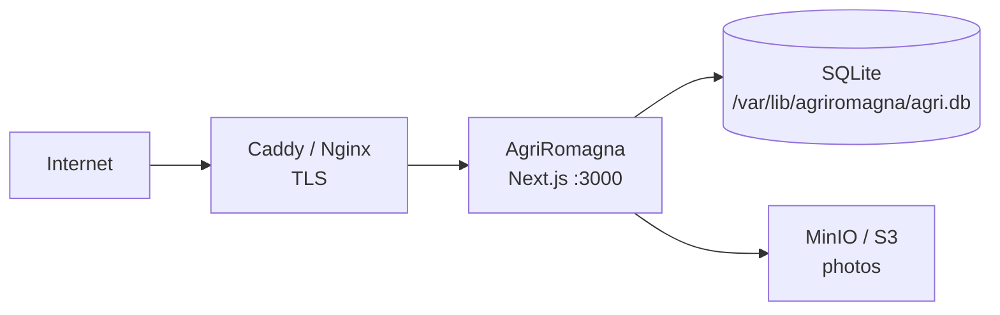

# Deployment

AgriRomagna is designed to be **boring to deploy**. One process, one SQLite file, one optional object store. There is no Kubernetes minimum.

## Reference topologies

### A. Single VM (recommended for ≤ 1 cooperative)



- 2 vCPU, 4 GB RAM, 20 GB disk handles a co-op of 100 members comfortably.
- Hetzner CX22 (€4.5/mo) or equivalent works.
- Use Caddy for automatic HTTPS.

### B. Per-cooperative isolation

For regulated environments or strict data residency, run one container per cooperative:

```bash
docker run -d --name coop-vigne \
  -p 127.0.0.1:3001:3000 \
  -e JWT_SECRET=$(openssl rand -hex 32) \
  -e DATABASE_URL="file:/data/coop-vigne.db" \
  -v coop_vigne_data:/data \
  agri-romagna:latest

docker run -d --name coop-faenza \
  -p 127.0.0.1:3002:3000 \
  -e JWT_SECRET=$(openssl rand -hex 32) \
  -e DATABASE_URL="file:/data/coop-faenza.db" \
  -v coop_faenza_data:/data \
  agri-romagna:latest
```

Route each domain to its container at the reverse proxy.

### C. Behind a managed PaaS

The standalone Next.js output works on any PaaS that runs Node 20. A few notes:

- Provide a **persistent disk** for the SQLite file. Ephemeral filesystems lose data.
- Set `DATABASE_URL` to an absolute path on the persistent disk.
- Disable scale-to-zero — SQLite write contention with multiple instances is not supported.

## Caddy example

```caddyfile
agriromagna.example.it {
    reverse_proxy 127.0.0.1:3000
    encode zstd gzip
    header X-Content-Type-Options nosniff
    header Referrer-Policy strict-origin-when-cross-origin
}
```

## Nginx example

```nginx
server {
    listen 443 ssl http2;
    server_name agriromagna.example.it;

    ssl_certificate     /etc/letsencrypt/live/.../fullchain.pem;
    ssl_certificate_key /etc/letsencrypt/live/.../privkey.pem;

    location / {
        proxy_pass http://127.0.0.1:3000;
        proxy_set_header Host $host;
        proxy_set_header X-Real-IP $remote_addr;
        proxy_set_header X-Forwarded-For $proxy_add_x_forwarded_for;
        proxy_set_header X-Forwarded-Proto $scheme;
    }
}
```

## EU data residency

For Italian cooperatives subject to GDPR and any sector-specific residency rules:

- **Hosting**: Hetzner (Falkenstein/Nürnberg), OVH (Strasbourg/Roubaix), Aruba (Italy), Seeweb (Italy).
- **Object storage**: MinIO on the same VM, or an EU-resident S3 provider.
- **Backups**: rotated daily to a second EU region.
- **Logs**: avoid third-party telemetry; the built-in telemetry stays in-process.

## Pre-flight checklist

Before exposing a deployment to real users:

- [ ] `JWT_SECRET` rotated from the dev default (32+ random bytes).
- [ ] `BCRYPT_ROUNDS` set to ≥ 12 in production.
- [ ] `DATABASE_URL` points to a persistent location.
- [ ] Daily backups configured and tested with a restore.
- [ ] TLS terminated at the reverse proxy with a valid certificate.
- [ ] Rate limiting verified at the proxy in addition to in-app limits.
- [ ] `PUBLIC_BASE_URL` matches the public hostname — affects QR codes and emails.
- [ ] Test harness endpoints (`/api/test-harness/*`) disabled (the platform refuses them when `NODE_ENV=production`).
- [ ] Seed data **not** loaded.
