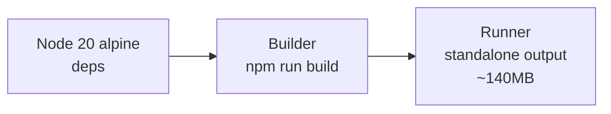

# Docker

AgriRomagna ships with a multi-stage `Dockerfile` and a single-service `docker-compose.yml`. The image is **~140 MB compressed** and runs the Next.js standalone output as the entrypoint.

## Quick start

```bash
docker compose up --build
```

Open [http://localhost:3000](http://localhost:3000). The database file is mounted as a volume so data survives container restarts.

## Build manually

```bash
docker build -t agri-romagna:latest .
```

Stages:



## Run manually

```bash
docker run -d \
  --name agri-romagna \
  -p 3000:3000 \
  -e JWT_SECRET="$(openssl rand -hex 32)" \
  -e DATABASE_URL="file:/data/agri.db" \
  -e NODE_ENV=production \
  -v agri_data:/data \
  agri-romagna:latest
```

## docker-compose.yml

```yaml
services:
  app:
    build: .
    ports:
      - "3000:3000"
    environment:
      - DATABASE_URL=file:/data/agri.db
      - JWT_SECRET=${JWT_SECRET:?must set JWT_SECRET}
      - NODE_ENV=production
    volumes:
      - agri_data:/data
    restart: unless-stopped

volumes:
  agri_data:
```

## Updating

```bash
git pull
docker compose build
docker compose up -d
```

Migrations are applied automatically at container startup (the entrypoint runs `prisma migrate deploy` before starting the server).

## Health check

The container exposes a liveness/readiness probe:

```bash
curl http://localhost:3000/api/health
# {"status":"ok","version":"0.1.0","uptime":42.1}
```

Add this to your orchestrator's healthcheck config.

## Backups

The only state is the SQLite file plus any uploaded photos. Back up the volume:

```bash
docker run --rm \
  -v agri_data:/data:ro \
  -v $PWD:/backup \
  alpine \
  sh -c "cd /data && tar czf /backup/agri-$(date +%Y%m%d).tar.gz ."
```

Restore by extracting back into the volume.
