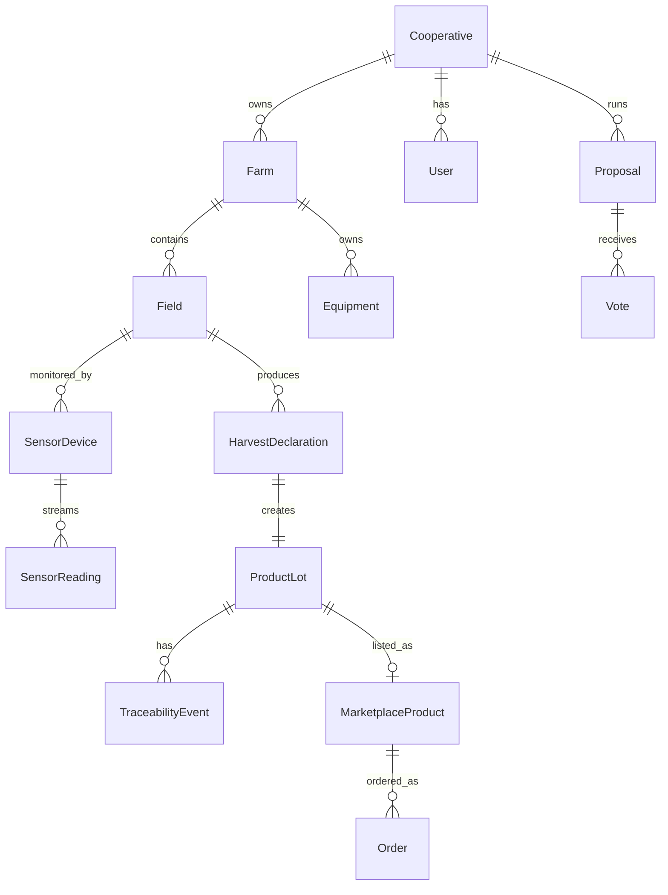

# Data Models

The full data layer is defined in `prisma/schema.prisma` — **36 models** in total. They are organized below by domain. For each model, see the schema file for the authoritative field list.

## Identity & tenancy

| Model | Description |
|---|---|
| `User` | Account, role, optional cooperative & farm |
| `Cooperative` | Top-level tenant |
| `Farm` | Sub-tenant inside a cooperative |

## Field & crop

| Model | Description |
|---|---|
| `Field` | A plot of land, with geometry, soil, current crop |
| `SoilAnalysis` | Lab analysis result tied to a field |
| `HarvestDeclaration` | Recorded harvest event |
| `YieldPrediction` | P10/P50/P90 forecast per field |
| `DiseaseRisk` | Time-series disease pressure score |
| `SprayPrescription` | Recommended treatment plan |
| `IrrigationSchedule` | Computed irrigation windows |

## IoT & sensing

| Model | Description |
|---|---|
| `SensorDevice` | Registered field sensor |
| `SensorReading` | One measurement |
| `NDVIReading` | Sentinel-2 derived NDVI per field |

## Compliance & traceability

| Model | Description |
|---|---|
| `ComplianceRecord` | Per-scheme certification metadata |
| `ComplianceEvent` | Hash-linked event on the compliance chain |
| `ProductLot` | A traceable batch of produce |
| `TraceabilityEvent` | Supply-chain event linked to a lot |
| `SupplyChainLot` | Aggregated lots moving together |
| `RegulatoryUpdate` | Tracked regulatory change |

## Financial

| Model | Description |
|---|---|
| `CostEntry` | One cost record |
| `RevenueEntry` | One revenue record |
| `InsurancePolicy` | Crop insurance contract |

## Sustainability

| Model | Description |
|---|---|
| `CarbonEntry` | Allocated CO₂eq event |
| `ESGIndicator` | Computed ESG metric per cooperative |

## Equipment & workforce

| Model | Description |
|---|---|
| `Equipment` | Tractors, harvesters, irrigation hardware |
| `MaintenanceEvent` | Maintenance log entry |
| `SeasonalWorker` | Worker profile |
| `WorkShift` | Scheduled shift |

## Marketplace

| Model | Description |
|---|---|
| `MarketplaceProduct` | Listing backed by a lot |
| `Order` | B2B order |
| `FarmBenchmark` | Anonymized benchmark contribution |

## Governance & communication

| Model | Description |
|---|---|
| `Proposal` | Cooperative governance proposal |
| `Vote` | A member's vote on a proposal |
| `CommunicationChannel` | Group channel inside the cooperative |
| `Message` | Channel message |

## Simulation

| Model | Description |
|---|---|
| `SimulationScenario` | Saved what-if scenario (e.g. drought, market price drop) |

## Entity relationships (high-level)

## Authoritative source

The above is a navigation aid. **The schema file is the source of truth:** [`prisma/schema.prisma`](https://github.com/ForliLabs/agri-romagna/blob/main/prisma/schema.prisma).
